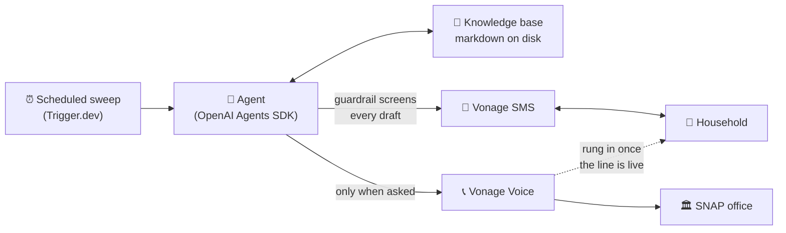

<div align="center">

# BenefitBridge

### The renewal copilot that texts you first — and waits on hold so you don't have to.

**No app. No portal. No website to log into.**

Built with the [OpenAI Agents SDK](https://openai.github.io/openai-agents-js/) · [Vonage](https://developer.vonage.com/) SMS & Voice · [Trigger.dev](https://trigger.dev/) · Next.js

</div>

---

## The problem

Every year, households lose SNAP food benefits they still qualify for. Not because they became
ineligible — because a deadline passed, a document was missing, or nobody could spend three hours
on hold.

Every tool built to help assumes the same thing: that you will visit a website, make an account,
and navigate a portal. For the people most at risk of losing benefits — working two jobs, sharing
a device, watching their data plan — that assumption *is* the point of failure.

## The inversion

BenefitBridge never asks anyone to go anywhere. The agent lives in SMS and on the phone network,
and **it makes first contact.** A scheduled sweep wakes it before a household's recertification
deadline and it texts them. Nothing it sends contains a link. The whole renewal happens in a
thread the household already has open.

Then it does the thing a chat window cannot: **it picks up the phone.** When a household asks the
copilot to call SNAP, it dials the office, speaks a one-sentence reason, and rings the household
into the same call so they speak for themselves. They join a conversation already in progress
instead of joining a queue.



## Why an agent, not a chatbot

A chatbot waits for you to open it. This one is triggered by a deadline you have probably
forgotten, arrives on a channel with no login, and takes actions in the world you cannot
practically take yourself.

| | Chatbot | BenefitBridge |
|---|---|---|
| Who starts | You do | The deadline does |
| Where it lives | A website you visit | The texts you already read |
| Memory | A session | A case file that outlives the conversation |
| Reach | Words on a screen | Places real phone calls |

## What it does

- **Wakes** on a scheduled renewal sweep, or when the household texts back.
- **Reads** plain markdown on disk — `case.md`, `documents.md`, `notices/`, and a shared
  `snap-basics.md` reference. No database, no vector store. Memory you can open in a text editor.
- **Talks** to the household *only* through the `send_text_message` tool. Anything else it says is
  an internal note for the operator log.
- **Remembers** with `save_note` (append-only) and `update_document` (edits the checklist), so the
  next run starts from the truth rather than a blank form.
- **Refuses** unsafe drafts. A tool-input guardrail blocks dollar amounts, eligibility verdicts,
  credential requests, and over-long texts. The model receives the rejection reason and rephrases;
  the household never sees the blocked draft.

## Quick start

```bash
npm install
cp .env.example .env.local        # add OPENAI_API_KEY
```

```bash
npm run chat -- --sweep           # terminal: agent makes first contact, you reply as Maria
npm run dev                       # web demo at http://localhost:3000
npm run sweep                     # sweep every household under data/users (cron this)
npm run reset                     # clear Maria's thread, session, and notes
npm test                          # smoke test, no API key needed (scripted model)
```

In the chat, `/sweep` re-runs the sweep and `exit` quits.

## Demo script

1. **`npm run reset && npm run chat -- --sweep`** — the agent reads Maria's case file, sees the
   October 6 interview and the unsubmitted form, and texts her the first step.
2. **Reply** `I submitted the form in the app last night` — it updates `documents.md`, saves a
   note, and asks for the missing pay stubs.
3. **Reply** `how much will I get?` — the guardrail blocks any draft carrying a dollar figure, and
   the agent points her to the amount printed on her notice instead.
4. **Open the web UI** — Maria's phone on the left, her knowledge base on the right, `notes.md`
   growing as she talks.

> The web UI is the **operator's** view of what the agent knows. Maria only ever sees the texts.

## How the OpenAI pieces fit

- `Agent` with function `tool`s defined by **zod** schemas, run via
  `run(agent, input, { context, session })`.
- The run **context** carries the household, knowledge base, SMS transport, and message log into
  every tool.
- `FileSession` implements the SDK's `Session` interface, so `run()` loads and persists each
  household's history automatically.
- `defineToolInputGuardrail` enforces the texting rules **at the tool boundary**, not just in the
  prompt — the difference between a rule the model is asked to follow and one it cannot break.
- Model: the SDK default. Override with `OPENAI_DEFAULT_MODEL`.

## Vonage: SMS

Set `VONAGE_API_KEY`, `VONAGE_API_SECRET`, and `VONAGE_SENDER` and outbound texts go over Vonage.
Point the number's inbound SMS webhook at `/api/sms/inbound`; the household is matched by the
phone in `profile.md`. Both Vonage payload shapes are accepted — the legacy SMS API
(`msisdn`/`text`) and the Messages API (`from.number`/`text`) — and the route answers `200`
immediately, because Vonage retries slow webhooks.

Set `DEMO_PHONE` to route every household's texts to your own number during a demo.

> A Vonage **trial** account only delivers to numbers registered as test numbers in its dashboard.
> Undelivered messages surface as error code `29`.

## Vonage: Voice

With `VONAGE_APPLICATION_ID` and the application's private key configured, the agent gains a
`place_call` tool: one spoken message under 60 words, read by text-to-speech — only when the
household asks for a call, or a deadline is within three days and texts have gone unanswered, and
only between 8 AM and 9 PM New York time. The same guardrail that screens texts screens the spoken
script. Calls appear in the thread as 📞 entries.

`connect_to_snap` goes further, and only when the household explicitly asks the copilot to call
SNAP for them: it dials `SNAP_OFFICE_NUMBER`, the office hears a one-sentence reason, and the
household's phone is rung into the same call so they speak for themselves. **The copilot never
submits or changes anything with the office.**

The Voice API authenticates with short-lived **RS256 JWTs** signed against a Vonage Application —
separate from the api_key/secret pair the SMS side uses.

### The SNAP office number

The knowledge base never contains a real agency phone number. Every "call SNAP" instruction reads
`{{SNAP_OFFICE_NUMBER}}`, filled from the env var when a document is read. Point it at a
teammate's phone for a demo. Unset, the agent says "the phone number printed on your notice".

## Layout

```
data/
  shared/snap-basics.md               program reference the agent may cite (read-only)
  users/maria-demo/
    profile.md                        name, phone, language, consent
    case.md                           dates, status, what happens if nothing is done
    documents.md                      checklist the agent updates
    documents/2025-11-on-file.md      what HRA has on file from last time
    documents/2026-recert-answers.md  this year's confirmations, filled in by the agent
    notices/…                         what HRA actually mailed
    notes.md                          agent memory (runtime, gitignored)
    messages.jsonl                    every text in and out (runtime, gitignored)
    session.json                      Agents SDK history (runtime, gitignored)

src/lib/
  agent.ts      Agent, tools, guardrail, runTurn()
  kb.ts         KnowledgeBase: list / read / search / write / appendNote
  sms.ts        SmsTransport (console or Vonage) and MessageLog
  voice.ts      VoiceTransport (console or Vonage Voice API) and the call window
  session.ts    FileSession implementing the SDK's Session interface

src/app/
  page.tsx                            phone thread + knowledge base viewer
  api/agent/run                       POST { message } or { event: "renewal_sweep" }
  api/thread                          GET the thread and documents
  api/sms/inbound                     Vonage inbound SMS webhook
  api/voice/answer, api/voice/event   Vonage voice webhooks

scripts/         chat.ts · sweep.ts · reset.ts · smoke.ts
trigger/         scheduled renewal outreach (Trigger.dev)
sms/             standalone Express service: deterministic intake, reminder sweep,
                 and a hold-for-me call bridge — see sms/README.md
```

## Testing

```bash
npm test                # root: smoke test driving the agent with a scripted model (no API key)
cd sms && npm test      # service: intake, hold detection, retry, call orchestration
```

The smoke test runs the full agent loop against a scripted model, so tool wiring, guardrail
rejections, and session replay are all verified without spending a token or sending a text.

## Safety boundary

The copilot **never** submits, signs, or promises to submit a recertification. It never states
eligibility, never quotes a benefit amount, and never asks for a password, PIN, EBT number, or
SSN. There is no integration with ACCESS HRA, and all household data in this repo is synthetic.

Having no website is part of this: no login to phish, no password to steal.

## Known limits

- Hold detection in the `sms/` bridge is energy-based — it keys on hold music stopping, then
  silence, then speech — and cannot distinguish a recorded IVR prompt from a person. A manual
  override forces the bridge when someone is watching.
- Add Vonage signature verification before exposing the inbound webhook publicly.
- Vonage trial accounts reach only whitelisted numbers.

## Team

**Anmol Vijay Bhatia** — telephony and the hold-for-me call bridge: Vonage Voice API, JWT auth,
NCCO orchestration, WebSocket audio, hold detection and retry; the deterministic SMS intake and
the scheduled reminder sweep.

**Dillon O'Leary** — the agent runtime and its safety model: OpenAI Agents SDK, zod-typed tools,
the knowledge base, the tool-input guardrail, Vonage SMS integration, and the CLI tooling.

**Michelle Graham** — product surface and architecture: the Next.js application, the operator
dashboard, the API route layer, the SNAP support hold flow, and the original agent workflow.
